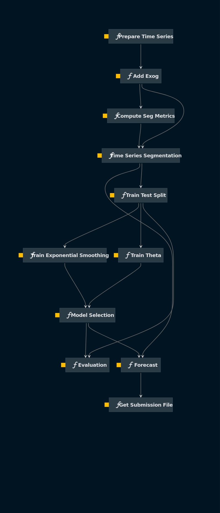

# Time Series Starter

## Overview

This is a kedro starter that build a project to multiple time series forecast. This project was initially developed for the [Store Sales - Time Series Forecasting challenge](https://www.kaggle.com/competitions/store-sales-time-series-forecasting), but can be easily adapted for other forecasting problems.

Take a look at the [Kedro documentation](https://kedro.readthedocs.io) to get started.

## How to use?
```
kedro new --starter git+https://github.com/matheusfsa/time_series_kedro.git
```

## Structure


